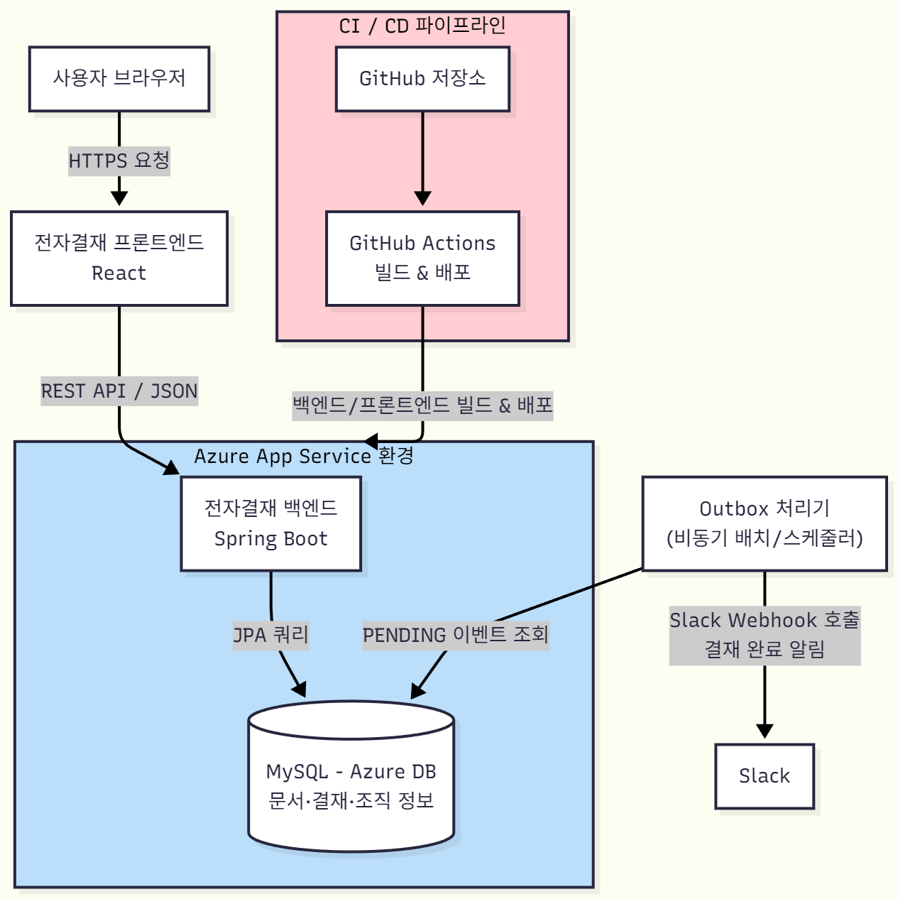

# 버섯상사 전자결재 시스템

가상의 회사인 **버섯상사**에서 사용하는 전자결재 시스템입니다.  
일반기안서, 휴가서, 매출등록 양식으로 결재 문서를 작성하고 결재 업무를 할 수 있으며,  
간단한 게시판과 캘린더 기능을 제공합니다.

---

## 개요
가상의 회사인 버섯상사에서 사용하는 전자결재 시스템입니다.  
일반기안서, 휴가서, 매출등록 양식으로 결재 문서를 작성하고 결재 업무를 할 수 있으며,  
간단한 게시판과 캘린더 기능을 제공합니다.

---

## 기획 배경
롯데에서 근무할 때 세븐일레븐 전자결재 시스템의 개발과 운영업무를 담당했었습니다.  
당시 시스템은 ASP.NET MVC 기반이었고, 대부분의 비즈니스 로직이 모두 DB 프로시저로 구성되어 있었습니다.  
SQL만 수정해서 비즈니스 로직을 수정할 수 있다는 장점이 있었지만 다소 가독성과 버전관리가 어렵다는 문제를 느꼈습니다.  

그래서 개인 프로젝트에서 이러한 문제점을 개선하기 위해 Spring 과 JPA를 활용한 전자결재를 만들어보고 싶었습니다.  
이 프로젝트에서는 기존의 DB 중심 구조를 REST API 기반 아키텍처로 재설계하고,  
업무 로직을 Java 코드로 직접 구현하여 유지보수성과 확장성을 높였습니다.  
또한 프론트엔드와 백엔드를 분리해 UI/UX 개선과 개발 효율을 강화했습니다.

---

## 인원
- 1명

---

## 개발 기간
- 2025.04.04 ~ 2025.06.19 : 결재, 게시판 등 핵심 기능 구현  
- 2025.07.31 ~ 현재 : 일정 관리 및 메신저 기능 확장, 리팩토링 진행 중

---

## 기술 스택

### 백엔드
- Spring Boot (Java) : RESTful API 기반 서버 구축  
- Spring Security + JWT : 무상태 인증 방식으로 로그인/권한 관리  
- JPA (Hibernate) : ORM 기반으로 객체 중심 설계 및 유지보수성 강화

### 데이터베이스
- MySQL (Azure DB) : 문서, 결재, 조직 정보 저장 및 조회

### 프론트엔드
- React (JavaScript) : 컴포넌트 기반 SPA 구조  
- Ant Design (antd) : 트리 구조로 게시판 사이드바 표현  
- FullCalendar : 일정 관리 UI에 사용

### CI / CD
- Azure App Service : 클라우드 호스팅 및 운영  
- GitHub Actions : 자동 빌드 및 배포 파이프라인 구축

---

## 주요 기능

### 결재 문서 작성/조회
- 문서 양식별 React 컴포넌트로 분리하고, 공통 화면(제목, 버튼 등)은 재사용하여 관리하도록 함  
- Idempotency Key를 사용해 결재 문서 중복 상신 방지  

### 결재 처리
- 결재 승인/반려 프로세스를 REST API 기반으로 구현  
- 메타데이터(approval_doc)와 본문(approval_doc_body)을 분리 저장하여 조회 성능 향상  
- 결재선에 작성자 정보를 포함해 일관된 결재 프로세스 유지  
- 결재 완료 시 Slack으로 알림을 발송하며, 메시지 발송은 Outbox 패턴으로 구현하여 안정성 확보  
- AOP를 활용하여 양식별로 후처리 로직을 분리  
  - 휴가신청서 : 일정에 자동 저장  
  - 매출보고서 : 매출관리를 위한 Redis 메시지 발행  

### 로그인 / 회원가입
- JWT 기반 무상태 인증 방식을 사용하여 세션 관리 부담 감소  
- 회원가입 시 인사 데이터(이름, 사번) 검증을 통해 인증된 직원만 가입하도록 제한  

### 일정 관리
- 회사 / 부서 / 개인 단위로 태그 기반 일정 관리 구현  
- 일정 생성 시 태그를 지정하여, 관련 사용자나 부서만 필터링하도록 구현  

### 게시판
- BoardMenu 엔티티에 depth와 parent_id 칼럼을 넣어서 트리 구조로 설계  
- 프론트엔드에서는 antd 라이브러리의 tree를 활용하여 계층형으로 표시  

---

## 주요 기능 화면

### 결재 작성 화면

### 결재 조회 화면

### 결재함 목록

---

## 시스템 구조

---

## 구현 및 문제 해결

### 결재 목록 조회 시 N+1 문제 발생
- 결재 문서 조회 시, 결재선 데이터 기반으로 결재 문서 데이터를 가져오면서 N+1 쿼리 문제 발생  
- DTO 프로젝션 기반 단일 쿼리 조회 : JPQL 형식으로 목록을 반환하여 DTO 페이지로 바로 투영  
- 필요한 연관은 JPQL에서 미리 join 쿼리를 작성하여 결합  
- 레포지토리에서 반환한 DTO 페이지를 그대로 반환하고 서비스 레이어에서는 다른 엔티티를 호출하지 않도록 함  

### 결재 중복 상신 방지
- 사용자가 같은 문서를 빠르게 연속 제출할 경우, 중복 상신될 가능성이 있음  
- 프론트에서 Idempotency Key를 요청 헤더로 발급해서 검증하는 구조를 추가하여,  
  동일 키로 요청 시 서버에서 자동 차단하도록 설정  

### 결재 상태 동시 변경 방지
- 하나의 문서를 두 사람이 동시에 회수/결재 처리하는 경우 결재라인 데이터와 문서 데이터의 불일치가 발생할 수 있음  
- JPA의 @Version 기반 Optimistic Lock을 적용하여, 버전 충돌이 감지되면 재시도를 유도하고 상태 불일치 방지  

### 결재 완료 알림 발송 시 데이터 불일치 문제
- 결재 완료 시 Slack으로 알림을 발송하는 과정에서,  
  트랜잭션 커밋 이전에 외부 API가 호출되면 상태 불일치가 발생할 위험이 있음  
- Outbox 패턴을 도입하여, DB 트랜잭션 내에서는 알림 이벤트를 OutboxEvent 테이블에 기록만 하고,  
  별도의 비동기 프로세스가 이를 읽어 Slack으로 발송하도록 개선  

### 결재 양식별 전략 관리
- 양식별로 후처리 로직이 달라서 서비스 코드가 복잡해지고 유지보수가 어려움  
- AOP를 활용해 전략 패턴을 적용하여, 양식별 후처리 로직을 독립적인 Bean으로 관리하고,  
  결재 완료 시 문서 유형에 따라 실행되도록 설계  
- 새로운 양식 추가 시에도 기존 로직을 수정하지 않게 해서 OCP 원칙 준수  
