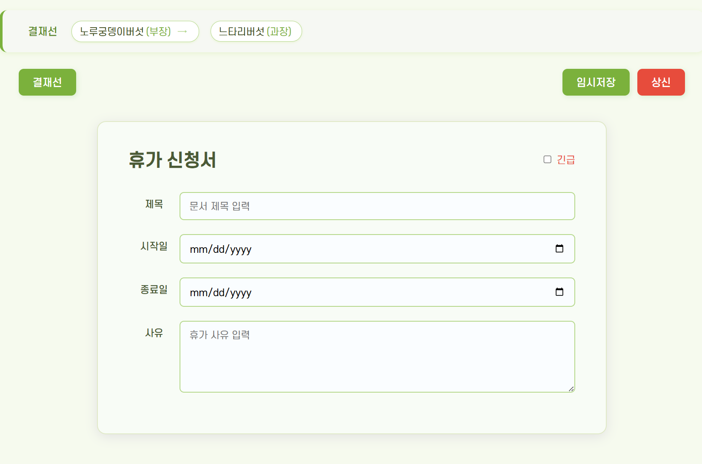
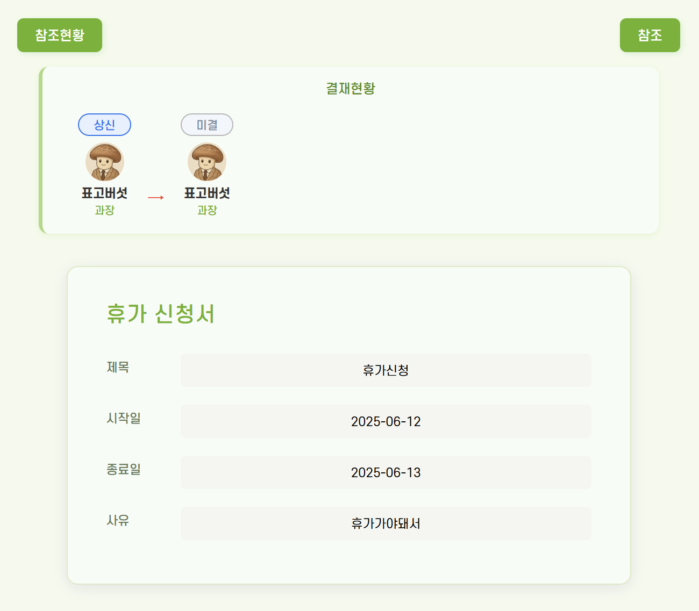
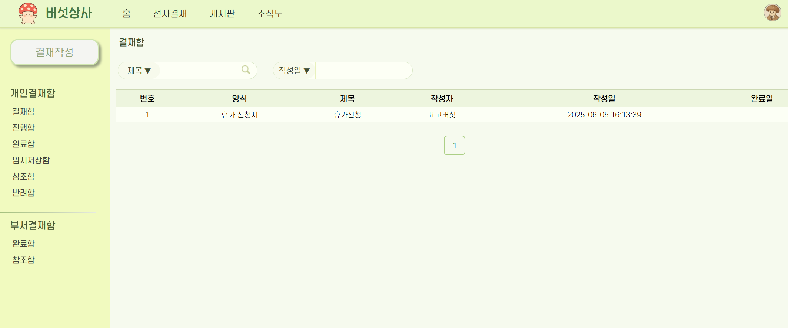

# 🍄 버섯상사 전자결재 시스템

Spring Boot + React 기반의 전자결재 시스템으로,
결재 상신, 결재선 지정, 승인/반려/회수, 참조 기능 등
현업에 가까운 다양한 결재 워크플로우를 구현하였습니다.

---

## 🔗 배포 주소: https://mushroom-doc.com
* [방문자용 로그인] 버튼으로 로그인이 가능합니다!

---

## 🧩 기술 스택

### Backend

* Java 21, Spring Boot 3
* Spring Security, JWT 인증
* Spring Data JPA (Hibernate)
* MySQL (Azure DB)

### Frontend

* React + Vite
* Toast UI Editor

### DevOps

* Azure Web App (프론트 + 백엔드 배포)
* GitHub Actions (CI/CD)

---

## 📸 주요 기능 화면

### 📄 결재 작성 화면



### 📄 결재 조회 화면



### 📁 결재함 목록



---

## 📂 폴더 구조 예시

```bash
📦 mushroom-backend
 ┣ 📂 controller
 ┣ 📂 service
 ┣ 📂 entity
 ┣ 📂 dto
 ┗ ...

📦 mushroom-frontend
 ┣ 📂 src
 ┃ ┣ 📂 pages
 ┃ ┣ 📂 components
 ┃ ┣ 📂 api
 ┃ ┗ ...
```

---

## ✅ 주요 기능

* [x] 결재 문서 상신
* [x] 결재선 지정 및 승인, 반려, 회수 처리
* [x] 사용자/부서 참조 기능
* [x] 결재함 (진행함, 완료함, 반려함, 참조함) 구현
* [x] JWT 기반 로그인 및 인증

---


## 👨‍💻 개발자

**김예진 (Yejin Kim)**
📧 Email: [yejin1.dev@gmail.com](mailto:yejin1.dev@gmail.com)

---

## 🥸 세계관 소개

> 버섯상사는 다양한 버섯들이 일하는 가상의 회사입니다. 팽이버섯, 느타리버섯, 흑목이버섯, 트러플 계약직까지! 귀엽고 말랑한 세계관 속에서 진지하게 문서를 결재하고 있습니다. 🍄
---

## 🪴 개선 예정

- 합의결재 기능 추가 예정
- 게시글 작성, 삭제 기능 추가 예정
- 수신결재 기능 추가 예정


